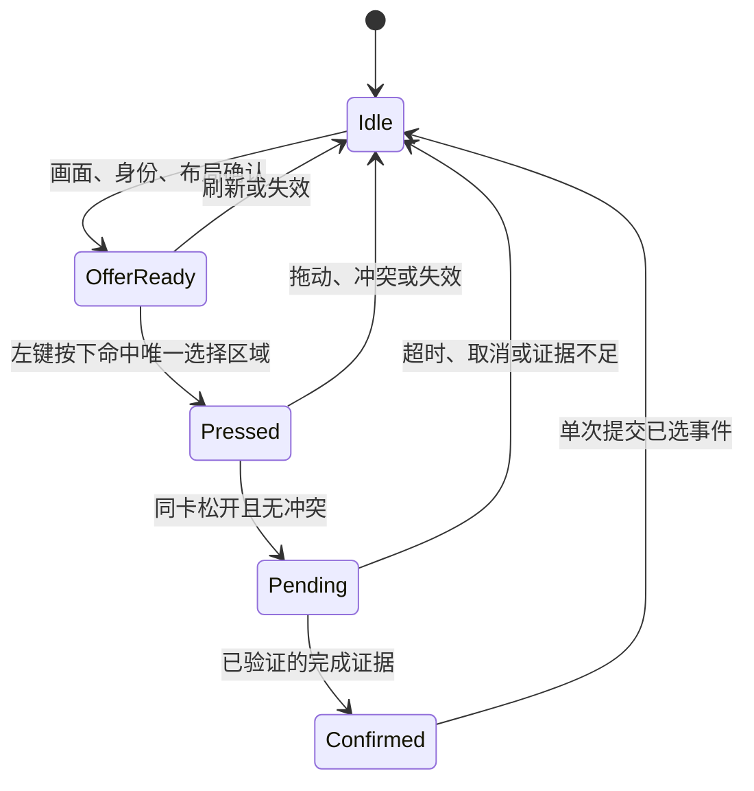

# 免打字检索与本局已选条件设计

日期：2026-10-06  
状态：**用户已确认并授权实施；T1/T2已实现，详情输入和选择事务已接入，自动记选仍待真实点击与回执验收。**  
代码基线：`13470619f53485d54c133bccd9e32ae3c2bc1158`（v0.2.3）。

## 1. 本次确定的方向

用户需要把游戏中的装备、强化、棋子等条件快速输入 DataJ 检索器，文字搜索作为最后保底。

- 版本列表仅在启动时联网获取一次，默认网站最新版本；不新增版本轮询。
- 优先展示本局**已经选中的海克斯和装备**，不能把未选候选混进来。
- 支持从游戏已经打开的名称/详情中读取条件。
- 暂不做图鉴，也不建立完整库存、合成计算或自动阵容决策。
- 沿用单条件检索习惯；条件输入不改变已固定阵容。

以下方案已获用户确认；实施进度及未通过的验收范围见任务文档。

## 2. 用户体验

检索器上方保留紧凑的条件输入区（2026-10-07 按用户确认的精简方向更新）：

```text
搜索阵容、英雄、海克斯、装备…              从游戏取条件
本局已选：[黑暗仪式] [已选神器] [已选光明装备] [更多]  ← 有记录时
检索条件：[当前条件 ×]              记为已选       ← 有条件时
平均排名 / 出场率                              最小样本 50
──────────────── 阵容结果 ────────────────
```

名称与图标一起显示；海克斯保留品质和必要后缀，装备保留类别。只加载可见条目的图片，图片失败时名称仍可点击。

### 2.1 已选条件

1. 用户正常在游戏里选择，助手不插入确认窗口，不操作游戏。
2. 自动确认成功后，只将实际选中的一项加入本局记录，其他候选不出现在这一行。
3. 收起助手不弹开面板；用户下次展开时可直接点已选项检索。
4. 点击条目立即替换当前单条件并查询，不再点“筛选”。选过多个资源不代表组合 AND。
5. 多次选到同一装备保存独立选择事件，展示可合并成一个快捷条目；不显示为当前库存数量。
6. 本局记录按最近选择排列，超出一行的条目放入“更多”。
7. 记录表达“本局选过”，不承诺装备仍未消耗、仍在库存或穿在某英雄身上。

自动确认失败时不把点击意图写入已选列表。若已确认选项身份、只是完成证据不足，可以在展开后的状态区提供一次可选的“确认本次已选”入口；不展示整组选项让用户重新选择。身份本身仍有歧义时，确认动作也不能随意挑一个 ID。

### 2.2 从游戏取条件

1. 用户自行打开装备、棋子或已选强化的名称详情；如悬停不能显示，使用游戏原本的点击/长按查看方式。
2. 按鼠标侧键，先截图，再识别主标题与必要上下文。
3. 唯一确认后直接填入检索器并展开结果页，显示所用条件。
4. 有可理解的品质/形态区别时，让用户点少量候选；无法区分的同名目录条目不能假装已经确认。
5. 失败不替换已有条件，给出“名称未确认，可重新打开详情或文字搜索”。
6. 从详情取到一个条件，**不自动表示本局已选**。只有支持的已选栏结果证据或用户明确确认，才写入已选记录。

首版默认检索类型支持装备（含纹章、神器、光明）、棋子、海克斯。羁绊只有名称及具体档位都经核实的布局才开放自动输入；不从棋子描述提取羁绊并添加条件。

### 2.3 侧键行为建议

建议保留现有侧键，采用互斥场景路由，避免另记一套组合键：

- 明确在海克斯/装备选择页：继续原均排补查，不自动打开检索器，也不把补查当成已选。
- 普通游戏画面，存在已验证的名称详情：执行一次取条件。
- 两者均不明确：不改变条件，提示打开详情或使用文字搜索。

一次触发只走一个动作。选择页标题拒识时不能顺势改走详情输入。先完成截图，再展开面板，避免助手抢焦点使游戏详情消失。若真实测试不能可靠区分两种场景，保留现有侧键行为，并将取条件配置到另一个侧键；不能把两个动作同时挂在一次触发上。

### 2.4 文字保底

2026-10-07 改为与阵容结果文字搜索共用一个输入框，不再保留“更多输入”、第二个文本框及筛选按钮。自由输入只筛当前阵容；下拉以“阵容 / 海克斯 / 装备 / 英雄 / 羁绊”标注类别，明确点选目录项才查询。普通回车不猜第一条，箭头选中后回车才确认；清除输入不清除当前检索条件，条件旁 × 单独清条件。名称与品质/形态信息足够时可点选消歧；没有视觉或来源契约能区分的条目，不能仅用人工点击一个陌生 ID 解决身份问题。搜索、定阵和本局已选记录仍是三个独立状态。

## 3. “已选”能否自动识别

### 3.1 已核实的基础及边界

当前程序已经知道选择页上的候选名称和部分卡位，已有被动侧键钩子及窗口守卫。但是：

- 鼠标钩子当前只上报侧键松开，尚不记录左键选择过程。
- 海克斯 `cards[].box` 是名称 OCR 框，不是整卡点击区域。
- 装备卡身之外还有“装备详情”按钮，海克斯还有刷新及隐藏按钮。
- 当前 `unknown` 表示未确认场景，不能解释成选择完成。
- 现有截图/录像没有相配的真实鼠标日志，不能据此宣称已经能确认用户最终选择。

代码依据：[鼠标通知](../../outputs/companion/mouse_shortcut.py)、[海克斯标题及画面读取](../../outputs/companion/vision.py)、[标题框解析](../../outputs/mumu-p0-probe/choice_reader.py)、[装备卡身定位](../../outputs/companion/item_vision.py)、[装备生命周期](../../outputs/companion/item_controller.py)。

Windows 低级鼠标钩子在输入将进入队列时提供事件；它不是游戏已接受选择的回执。因此，点击命中和选择页消失都不能单独成为提交依据。[微软事件说明](https://learn.microsoft.com/en-us/windows/win32/winmsg/lowlevelmouseproc)

### 3.2 自动确认的必要条件

全部成立才写入一条已选记录：

1. 点击前有新鲜、可验证的选择画面，所点项具有唯一确认的实体身份。
2. 同一卡位的左键按下/松开绑定同一选择流程；无拖动、边界重叠或不同卡位冲突。
3. 命中经真实画面标定的可选择区域，排除刷新、详情、隐藏及游戏其他控件。
4. 窗口身份、前台、画布、DPI及冻结快照没有发生异常失效；预期的选择完成动画或选择页关闭不属于刷新失效。
5. 点击后出现**经真实序列验证的选择完成证据**，例如可核实的选中动画/标记或已选栏结果；不是一个通用 `unknown`。
6. 同一次选择事件尚未提交。

仅“点击某卡→正常棋盘”是否足以作为某个具体布局的完成判据，需要真实输入和前后画面证明；本方案不提前认为所有布局都满足。

没有足够的完成信号时，自动记录保持关闭或仅对已验收类型开放，使用详情取条件或可选人工确认保底。不能为了记录率而把推测放进“已选”。

冻结的点击前快照独立于当前浮层状态保存。若游戏在按下后、松开前开始完成动画，先保存完成证据，等待同一卡位的有效松开，再提交。当前候选从画面退出或普通查询失效不能提前销毁这个事务；刷新、几何变化、失焦及冲突点击仍取消它。没有配对松开或明确完成证据则不提交。

### 3.3 状态机



内部候选和 `Pending` 不显示为已选。同一画面的重复 OCR 复用流程；真实刷新、身份/卡位变化或新一轮选择才更新流程编号或候选版本。不能用“回合＋装备 ID”替代流程身份。

### 3.4 必须拦截的情况

| 情况 | 处理 |
| --- | --- |
| 刷新换牌、描述/卡位改变 | 旧流程失效；不能将旧点击绑定到新选项 |
| 刷新、详情、隐藏按钮 | 不产生选择意图；待确认期间点击这些按钮也取消意图 |
| 快速点不同卡 | 无明确实际结果证据时不提交，不取最后一次点击 |
| 同卡连点 | 合并一次选择事务，确认后仅提交一次 |
| 单帧动画或暂时没有卡片 | 不提交，等待有限时间的正向完成证据 |
| 失焦、最小化、窗口移动或 DPI 改变 | 取消待确认事务，重新建立几何及候选 |
| 点击比 OCR 更早 | 不套旧候选；允许漏记并走取条件保底 |
| 系统超时自动选择、键盘或宏选择 | 无直接已选结果证据时不猜 |
| 同回合再次选择或同装备再次获得 | 新事件独立处理，不误去重成上一轮 |
| 打开助手、查询或均排成功 | 不构成已选证据 |

## 4. 实体身份与查询正确性

三个入口统一经过实体映射，不各自猜 ID。结果包含实体类别、目录身份、名称、必要的品质/形态及可验证来源。

- 英雄采用 DataJ 当前网页的基础英雄归一规则，星级另作查询条件，默认任意星级。阿木木原始 `14503/24503/34503/44503` 对应基础 ID `4503`；阿卡丽 AD/AP 仍保留 `1506/1513` 两种身份。
- 海克斯保留 `+` 和罗马数字。重复名称用实际品质、描述等可观察证据区分，不能按排名或目录顺序选择。
- 装备保留成装、神器、光明、纹章等类别，不能将同名装备或相似图标互换。
- 少数名称、品质、描述均相同但 ID 不同的条目，先核实 DataJ 等价/额外上下文规则；未核实前不能自动检索。
- 点击、OCR 和文字选择默认都只构造一个条件；不偷偷加入英雄星级、装备携带者、数量、海克斯取得阶段、排除或组合筛选。
- 海克斯取得阶段可作为记录说明，不能无声地改变原检索器条件口径。

本轮已重新核查当前 Explorer 页面及映射脚本，英雄归一规则仍与保存的源码一致。[当前映射脚本](https://www.dataj.cc/_next/static/chunks/10uht6~-1m-_v.js) [本地对应源码](../../work/dataj-p0-agent/10uht6~-1m-_v.js)

## 5. 模块与状态拆分

优先复用现有窗口守卫、截图/OCR队列、目录、DataJ请求及 CompBrowser，不更换技术栈。

| 模块职责 | 输入 | 输出与边界 |
| --- | --- | --- |
| 版本启动协调 | 一次版本列表响应 | 当前最新补丁、默认选择；成功后才预热统计 |
| 实体映射 | 游戏主标题/上下文或目录选择 | 唯一查询实体，或明确歧义；所有输入共用 |
| 选择事务跟踪 | 已识别候选、被动点击、完成证据 | 单项已选事件；不依赖均排请求是否成功 |
| 详情取条件 | 主动触发、触发点、截图、目录 | 单个检索条件；不自动写已选 |
| 本局已选存储 | 已确认事件或明确人工确认 | 轻量事件记录及快捷条目；不保存库存 |
| 条件输入控制 | 已选条目/取条件/文字选择 | 替换当前单条件并查询；保持定阵 |

### 5.1 三类状态分开

1. 当前候选：短期选择画面、槽位、身份、几何与图像指纹。
2. 本局已选：已确认的选择事件，独立于浮层和查询回调。
3. 当前检索条件：用户当前想查的一个实体。

浮层清空、收起面板、查询失败或切换阵容不能删除已选记录。切统计补丁只让统计及相关请求失效，不能调用现有 `new_game()` 顺带清本局意图。

### 5.2 最小元数据

选择事务保存 `session_id/offer_id/offer_revision/window_identity/geometry_revision/frame_time/slot/entity/down_event/up_event` 及完成证据引用。

已选事件保存 `selection_event_id/session_id/kind/entity_id/name/category/round/selected_at/source`。来源限定为验收通过的自动选择、直接已选详情证据或明确人工确认。

默认只保存内存中的本局数据，不保留整张4K图片或建立复盘库。诊断材料在测试时按需保存。快捷条目可以按实体合并，事件身份不能合并；选择次数不是库存数量。

### 5.3 新局与重置

- 重启助手及点击“新的一局”均开始空记录。
- 确定游戏窗口关闭/更换或有可信新局信号时，旧选择事务取消，本局记录停止作为当前局快捷入口。
- 自动新局判断使用经过验收的信号，例如本局已确认进入后续阶段后，新鲜有效画面再次确认新局 2-1；一次 OCR 值倒退不够。
- 同局额外选择、失焦、详情页暂时遮挡不是新局。
- 新局边界无法确认时，不拼接上一局记录；显示状态待确认，并保留现有新局重置入口。

## 6. 性能与输入约束

- 新功能空闲时新增截图/OCR调用为 0。
- 鼠标钩子只复制必要事件并立即传递输入；不在钩子内截图、OCR、联网或保存文件。[事件结构](https://learn.microsoft.com/en-us/windows/win32/api/winuser/ns-winuser-msllhookstruct)
- 选择确认优先复用现有画面。确需补拍时，仅在有效选择点击之后执行有限次短时检查，候选建议上限3次、总窗口不超过2秒；最终时间参数由真实序列定标，不通过提高常态扫描频率提高记录率。
- 取条件默认每次触发1次截图；已验证布局使用局部区域，其他支持布局可先截一次游戏客户区，再只对主标题区域 OCR。截图数量与原选择页补查分别计数。
- 工作放入已有串行队列，不堆积过时鼠标请求。新触发可以淘汰旧请求，迟到回调不能替换更新后的条件。
- 温热状态侧键到正确条件填入的拟定 P95 目标为1秒以内；冷启动、排队及网络结果返回分别测量，不引用纯 OCR 耗时充当总延迟。
- 内存测量包含主进程及 WebEngine 子进程；记录本局元数据，不长期持有截图。

## 7. 版本规则

启动成功路径只自动获取一次列表，以网站当前默认及列表顺序确定最新，不自行按字符串排序。列表成功前不使用固定18.2a预热统计。

当前核查默认为18.3，列表是18.3、18.2a、18.2、18.1.c、18.1b、18.1；这些是2026-10-06的观测，不写死到实现中。[网站列表](https://www.dataj.cc/comp)

运行中允许手选已有历史版本；无后台轮询、无展开下拉时自动联网刷新。启动失败保留明确提示及手动重试；如使用上次成功目录，只能标为缓存版本、未核实最新，不能静默回落固定版本或冒称最新。

## 8. 用户故事

1. 作为玩家，我希望启动后默认使用网页最新统计版本，以免忘记切换版本。
2. 作为玩家，我希望正常选择后只看到自己选中的强化或装备，以便一键检索。
3. 作为玩家，我希望未选择、刷新掉或只查看过的选项不进入已选记录，以免误导查询。
4. 作为玩家，我希望确认失败时能补查或明确确认，而不被强行记录一个猜测。
5. 作为玩家，我希望从游戏里已经打开的名称详情直接取条件，以免输入名字。
6. 作为玩家，我希望侧键在选择页继续补查均排，在详情页能取条件，以减少记忆操作。
7. 作为玩家，我希望有歧义或读取失败时保留原查询，并能用文字保底。
8. 作为玩家，我希望输入一个条件不会取消已固定阵容或自动组合其他条件。
9. 作为玩家，我希望收起、换阵或切统计版本后仍保留本局已选，而新局不混入旧记录。
10. 作为玩家，我希望新增功能不会持续截图、抢焦点或截断游戏鼠标操作。

## 9. 验收与交付门槛

| 验收项 | 必须满足 |
| --- | --- |
| 已选真实性 | 未选、刷新、详情、隐藏、失焦、动画未知帧等负例不生成已选；每个确认事件只发布正确单项 |
| 正例覆盖 | 分别报告确认正确、漏记及错误记录；不能以全部拒识获得“零误记录”结论 |
| 身份合同 | 最终POST里的类别及targetId与原站规则一致；英雄星级、形态、装备类别、强化后缀单独覆盖 |
| 自动确认门槛 | 清晰且支持布局的独立留出事件，拟定正确记录/正确取条件率≥90%，观测错误自动ID或未选误记录为0；缺真实完成证据的类型不开自动确认 |
| 真实输入 | 在MuMu全屏验证左键透传、侧键动作互斥、截图先于展开、实际选择未被改变 |
| 生命周期 | 换牌、不同轮选择、同装备重复选、新局、切版、乱序回调、快速点击均有回归 |
| 性能 | 无新常态截图/OCR；短时补拍有界；本机真实测量热/冷延迟与整进程树内存，不宣称回放等于FPS验收 |
| 交付 | 在仓库外运行实际便携EXE验证同样路径，结果包含已支持与未支持类型、样本范围及局限 |

开发样本与验收留出集按对局/录像来源分离；相邻视频帧及同事件多视图不增加独立样本数。自动确认选择的样本必须有人工真值、真实点击与前后画面；只有截图或OCR日志不够。尽量复用已有S18资料及测试时主动记录，不把用户批量截图作为前置要求。

“测试中零错误”只说明本次独立事件未观察到错误，不承诺所有未来画面绝不漏记/误记。

逐类验证可以先交付有明确支持范围的候选包；未通过的类型仍记为未完成。在用户另行同意缩小首版范围前，不将缺少海克斯、成装、神器或光明自动确认的局部交付视为整个任务已完成。

## 10. 本次不包含

图鉴、完整库存及装备归属、自动合成、自动点击/选牌、宏输入接管、棋盘全量持续扫描、多条件自动决策、复盘库、后台版本轮询、自动更新及GitHub发布。

实施任务见 [免打字检索任务](免打字检索任务-20261006.md)。
