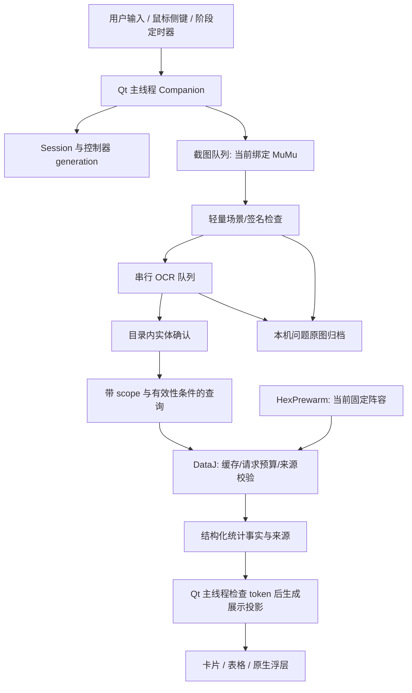

# 当前架构与实施边界

更新日期：2026-10-10。

本文是当前源码架构的主入口，说明模块职责、实际数据流、状态有效性、来源查询预算和验证边界。产品使用见[项目说明](../../README.md)，功能验收见[测试运行说明](../testing/README.md)。

**本轮状态：架构优化、上库及 v0.2.15 公开交付完成。** 结构化海克斯统计事实、旧排队查询执行前检查和应用级共享 DataJ 请求预算已经接入实际应用链路。接口及源码检查结果见本文；上库、CI 与实际发布包的验收对应[v0.2.15 版本记录](../releases/v0.2.15.md)及[逐次验收记录](../development-records/2026-10-10-architecture-release.md)。首次 v0.2.14 候选因 CI 失败未公开，失败与修正保留在记录中。几何上下文与损坏缓存问题由其他任务独立修复和验收，本轮未修改或独立验证这些问题，不将其计作本轮已完成成果。

[MVP 技术设计](../../outputs/MVP技术设计.md)及 `outputs/` 中的原始研究、试验和开发阶段文档保留当时的目标、成本估算及证据。它们解释方案来源，不代表所有规划模块已按原形态部署。本文按实际源码描述现状；历史验证数字只对应原记录的提交、环境和样本。

## 1. 应用形态与部署

运行主体是 Windows x64 上的 Python 3.12 / PySide6 桌面应用。Qt 主线程管理控件、当前游戏状态和结果发布；截图、OCR、网络及问题归档使用有界后台队列。应用不读取游戏进程内存，不注入游戏点击或按键；原生侧键监听把触发通知送回 Qt 队列，原操作继续传递。

桌面主程序采用单实例模式。`single_instance.SingleInstance` 持有当前 Windows 登录会话中的命名 mutex，正常启动在创建 QApplication 之前获取它，进程退出或启动异常后释放。`--self-test` 与 `--diagnose` 有自己的诊断路径。Qt WebEngine 会创建浏览器辅助进程，因此“单实例桌面应用”不表示系统中只有一个 OS 进程。

| 边界 | 当前实现与入口 |
| --- | --- |
| 源码启动 | 根目录 `启动助手.cmd` → `outputs/companion/start-companion.cmd` / `launch.py` → `app.main()`；依赖本机 `work/p0-runtime` 及其基础 Python |
| 便携构建 | `packaging/build_windows.py` 与 `companion.spec` 收集 Python、Qt/WebEngine、OCR 运行库、模型及应用资源，生成 PyInstaller 单目录 ZIP |
| 资源定位 | `bootstrap.py` 区分只读资源与可写用户状态；源码资源保留两处 `outputs/` 运行目录的相对关系 |
| 可写状态 | 源码使用 `work/companion/`；EXE 使用 `%LOCALAPPDATA%/TFT-DataJ/`；发行包不携带用户原图或开发缓存 |
| 当前平台/赛季 | Windows 10/11 x64 是交付目标；数据适配器当前限制 S18 与合法 `18.x` 统计版本；没有通用赛季插件体系 |

源码集中在 `outputs/companion/`，共用的窗口、截图、布局和阶段统计模块仍位于 `outputs/mumu-p0-probe/`。这两个目录属于运行源代码，名称中的 `outputs` 不表示可删除的生成物。本轮维持路径兼容，先改进模块之间的合同，暂不进行全仓目录迁移。

## 2. 实际模块与职责

| 模块 | 所有的责任 | 调用关系及边界 |
| --- | --- | --- |
| `app.py::Companion` | 应用组合、主面板、启动版本门槛、Qt 队列、生命周期、海克斯交互、攻略与出装页面 | 是当前组合入口，尚未拆成独立 CaptureScheduler / StatisticsService / QueryService 等规划组件 |
| `core.py::Session` | 本局 ID、查询 revision、赛季/版本、阶段、候选和固定阵容 | 生成 token；变更上下文后使旧查询结果失效 |
| `background_jobs.py::Job` | 在现有 Qt worker 池中执行任务前检查有效性，区分成功、来源失败与过期取消 | `is_current` 只读取线程安全状态，不访问 GUI 控件；执行中不硬取消 |
| `vision.py::Vision`、`scene_gate.py` | 海克斯场景门槛、回合与名称 OCR、多视图身份确认、像素签名复验 | 使用 RapidOCR / ONNX Runtime；不靠排名大小决定实体身份 |
| `item_vision.py`、`item_controller.py::ItemController` | 3–5 项装备候选、类别/ID、稳定画面、请求队列和装备浮层生命周期 | 与主应用共享截图/OCR队列；数据值来自 `item_stats.py` 与 DataJ |
| `condition_reader.py`、`condition_controller.py` | 用户明确触发的游戏详情读取、互斥场景路由和单条件检索 | 不持续扫描整屏详情；取条件成功不等于本局已选 |
| `entity_identity.py`、`hex_catalog.py`、`core.py` | 赛季内实体索引、品质/形态区分、受约束的等价目录投影 | 同名、图标相同、统计有值均不能单独授权合并 |
| `selected_resources.py`、`selection_controller.py` / `selection_tracker.py` | 本局已确认选择事件、快捷条目、选择事务与证据门槛 | 当前自动选择布局白名单为空；实际使用仍需明确“记为已选” |
| `dataj.py::DataJ` | 来源参数、HTTP、SQLite 缓存、响应结构与数值校验、精确海克斯补查 | 缓存与查询身份包含完整 scope；网络失败不使用其他版本均排 |
| `source_budget.py::SourceBudget` | 同一应用来源的锁、HTTP/后台槽位、访问间隔、失败冷却与同键在途 Future | 经 `DataJ(..., budget=...)` 注入，统计版本仍由各 adapter / query 隔离 |
| `hex_stats.py` | 阵容主表缺项的同 ID / 同阶段补查，逐项结果与来源记录 | 全局、阵容、其他阶段之间不互相冒充 |
| `hex_results.py` | 结构化海克斯阶段统计、scope、成功事实保留与最终文案投影 | `ResultScope` / `HexStatistic` / `HexChoice` / `HexResults`；使用数据状态保留成功值 |
| `hex_prewarm.py::HexPrewarm` | 一个固定阵容与本局内的后台全量预读、未来阶段优先、整局正/负结果复用 | 取消固定、切版本、新局或关闭时失效；前台查询暂停继续发出后台请求 |
| `comp_browser.py`、`ui_theme.py`、`item_overlay.py`、`floating_mark.py` | 阵容卡片、候选结果、装备浮层、收起标记和头像 | 是展示投影，不能以格式化文字反推统计成功状态 |
| `bug_reporting.py`、`bug_cases.py`、`diagnostics.py` | 有界本机问题归档、pending/oracle、运行事件与可选诊断帧 | 复用已获取原图；私图不上传，不自动生成“正确答案” |
| `tools/validate_data.py`、`regression_registry.py` | 测试发现、逐方法结果、历史保护、公开 fixture 与私有批准索引 | 测试通过不自动升级台账中的 partial 覆盖 |

以上为当前真实职责。将来若抽出更小的控制器，需保留这些输入输出与失效规则；不以新增类名或目录层级替代行为验证。

## 3. 数据流与线程边界



图中“结构化统计事实”是本轮采用的合同，海克斯分支已接入 `hex_results.py`；装备通过结构化 `status` / 数值 / 样本字段表达。数据事实和 UI 文案必须是单向关系。

当前 `Companion` 建立四个 Qt 线程池：截图 1 线程、OCR 1 线程、普通网络 1 线程、海克斯网络 2 线程。海克斯精确补查另有最多 3 个 Python executor worker；`HexPrewarm` 有一个后台线程；问题归档有单独的单线程池。`Companion.submit()` 限制保留的 Job 数量为 8，Job 执行后释放闭包；这一限制不等同于所有下游 HTTP 或原生线程的总数。

OCR 引擎初始化在 `catalog_loaded()` 的 Qt 主线程执行，因为此前运行环境在 Qt worker 首次初始化/推理时出现崩溃；后续识别仍在串行 OCR 队列。此项是现有兼容选择，不在未经复验时移回后台线程。

Qt worker 仅完成读取、识别或查询，并通过信号交回结果。控件修改和当前状态提交在主线程完成。Python `threading.Lock`、Future 与 semaphore 管理来源共享状态；网络 I/O 不持有状态锁，SQLite 请求使用各自连接。

### 3.1 启动与版本

1. 初始化只读资源、用户状态、单实例保护、Qt 控件及本局 Session。
2. 在线启动只读取一次 DataJ 网页版本列表，按来源顺序选择首项。
3. 版本列表未准备好时禁止目录、统计和实时捕获；失败、空列表或结构变化保持暂停并允许用户显式重试。
4. 用已选版本的全局统计构造受约束的海克斯目录投影，再准备 OCR、阵容页面和装备预热。
5. 用户手选历史版本时建立相应 adapter、撤下旧显示并重读相关数据；攻略网页的原站版本与助手统计版本分别说明。

### 3.2 画面、身份与显示

自动路径先检查绑定窗口及前台，再读取少量回合/装备区域。海克斯首次确认后约 0.5 秒复查画面；装备活动期间也约 0.5 秒检查稳定标题，平时约 2 秒探查装备区域。回合探查约 3 秒，2-1 / 3-2 / 4-2 开启受限检查窗口。数字是调度配置，不能解释为实战端到端延迟保证。

名称必须获得受约束的 OCR 与目录证据。未知、冲突、同名不同品质、阶段不明等状态保留拒识或用户确认，不借统计结果猜 ID。已经确认且像素签名一致时复用结果；真正换候选或场景结束后清空旧显示。奥恩缺卡框但已确认标题仍稳定的保持规则见[原修复记录](../testing/ornn-display-20261009.md)，不代表本轮已在新对局验证。

用户侧键只读取一次已绑定的前台游戏画面，详情、海克斯和装备路径互斥。取到详情名称后设置明确单条件并查询，保留原条件的失败路径；只有用户明确确认才进入 `SelectedResources`，候选出现、查询成功或选择页面消失均不自动记选。

### 3.3 数据查询

| 用户场景 | 主要来源及处理 |
| --- | --- |
| 阵容推荐 | `/comp/rank` 或单条件 `/explorer/query`；先按对应范围样本筛选，再排序/分页；无条件结果不代替失败条件结果 |
| 当前海克斯 | `/stats/hex` 的精确阶段值；定阵后 `/comp/<id>/hexes`；主表缺项再同版本、同 ID、同阶段检索，最多三项逐个显示 |
| 装备选择 | 全局/阵容装备表，必要时单装备精确检索；持有者按对应范围英雄 ID、均排与样本筛选 |
| 英雄出装 | 固定阵容、英雄 ID 的单件/三件套表，类别筛选、默认 50 局门槛与排序 |
| 原站攻略 | Qt WebEngine 的 DataJ HTTPS 页面；其页面版本不自动改变 Session、复制码或统计版本 |

数据主体由来源请求给出，不通过其他英雄平均值、全局均排或别的阶段合成缺失值。数值验证拒绝布尔值、NaN/Infinity、错误阶段索引、负样本、错实体及不合法统计范围。

## 4. 状态、取消与结果发布

`Session.token()` 当前为 `(session_id, revision, set_id, patch, target)`。阶段和候选的变化通过 `set_choices()` / `invalidate()` 增加 revision；新局同时更换 session ID；固定阵容与取消固定也更新查询有效性。

同一个游戏窗口内的新对局仍以应用内“新的一局”为明确入口，统计版本也需用户与游戏版本核对；没有通用自动新局/补丁检测。窗口句柄/PID/进程身份变化会清除上一窗口的选择上下文，不能据此宣称已经识别所有游戏内局界限。

| 状态域 | 所属模块 | 失效规则 |
| --- | --- | --- |
| 本局与海克斯查询 | `core.Session` | 候选、阶段、版本、阵容、新局与场景失效使旧 token 不再接受 |
| 阵容/攻略/出装页面 | `Companion` 的 catalog/explorer/comp/equip generation | 同时核对 adapter 和 generation，迟到回调不改变当前控件 |
| 装备选择 | `ItemController.generation` + Session token + adapter identity | 重置会清队列、结果和图像引用；已执行结果仍须检查有效性 |
| 明确取条件 | `ConditionController` 的 generation、输入 revision、scope、本局、adapter、窗口上下文 | 输入或窗口上下文改变后不覆盖原检索；需当前前台窗口 |
| 固定阵容预读 | `HexPrewarm` 的 adapter/set/patch/comp/current 及取消事件 | 新局、换版本、换阵容、取消固定或关闭后不继续出版旧结果 |
| 本局已选 | `SelectedResources` 与 `SelectionController` | 查询 revision 变化不直接删除已确认选择；新局/真实窗口身份变化才清本局历史 |

有效性分成三个位置，不能仅依赖回调时检查：

1. **入队时**：捕获这次查询所依赖的 scope、token 或 generation。
2. **真正执行前**：旧排队任务若已失效就不调用来源，避免占据稀缺队列和请求预算。`background_jobs.Job(fn, is_current=...)` 负责这一检查；已接入目录、阵容列表/条件检索、固定阵容详情和英雄出装四条 `Companion` 查询链。
3. **收到结果后**：再次核对有效性，迟到结果不更新控件、当前模型或浮层。

取消主要是使后续执行和发布失效。已经发出的 HTTP 不保证即时中断；它可能完成当前 I/O，预算和失败冷却也不能因取消消失。后台预读在已有请求完成后遵守来源间隔，前台优先不会变成无限并发。退出流程停止 timer、监听、控制器及预读，清等待任务并等待池内执行者结束。

`Companion.submit(pool, fn, done, failed=None, *, is_current=None, cancelled=None)` 保留现有八任务准入上限，使用 Qt queued connection 接收 `done(object)` / `failed(str)` / `cancelled()` 三种终态。过期路径释放 Job 和信号闭包，调用必要的取消收尾，不显示用户错误；失败路径才进入来源错误处理。Job 的 `finally` 清空 `fn` 与 `is_current` 引用，避免已取消任务持续持有截图或控制器。

可用的统计事实与当前能否绘制浮层是两种状态。失焦、面板展开、截图过旧或捕获进行中会隐藏浮层，但不能把短暂失焦解释成来源返回失败。绘制仍要求新鲜前台画面、有效 token 及已确认位置。几何上下文的进一步统一保护正在另一任务处理，完成前不宣称所有缩放/移动/DPI 变化已覆盖。

## 5. 统计事实与展示投影

本轮采用 `hex_results.py` 的结构化海克斯统计模型，让“统计是否可信/可用”由字段决定，而不是解析 UI 的 `3.70 · 4791局` 文字。实际接口如下：

| 接口 | 字段 / 行为 |
| --- | --- |
| `ResultScope` | `set_id, patch, stage, comp`，限制整组统计与保留条件 |
| `HexStatistic` | `status, average, samples, source, supplemented`；`ready` 仅由 `status == 'ok'` 决定 |
| `HexChoice` | `identity, name, global_stat, comp_stat`，按候选顺序保留槽位 |
| `HexResults` | `scope, choices, retryable, supplement_errors, pending_ids`；提供可用数量、补查 ID 与来源投影 |
| `build_hex_results(...)` | 将已验证的来源结果与候选构造成事实；同 scope / 同 ID 顺序且补查未终结时可保留旧成功阵容事实 |
| `statistic_text(...)` / `HexResults.rows` | 从事实生成现有文案 / 表格兼容视图，不能作为事实回读来源 |

`Companion.stats_payload['result']` 保存 `HexResults`，`rows` 继续作为已有测试与表格的兼容投影。卡片使用 `ResultCard.update_statistics(choice)`，表格与浮层的颜色从数值字段产生；离线旧入口保留 `stat_text()` 兼容包装。

一个候选槽位至少需要：实体 ID/名称/槽位、明确统计 scope、全局统计、阵容统计、各自状态及来源、是否为当前补查、待查/失败情况。成功统计保存数值、样本和阶段；缺项、未识别、未定阵、读取中与失败具有独立状态。不能因为显示文案变化丢失事实，也不能把错误文案当数值。

来源 scope 包含赛季、版本、阶段、实体 ID，以及全局或指定阵容。精确补查保留实际来源 URL、获取时间、缓存标记、样本与完整 scope。全局/阵容值、主表/补查来源分别保存；主表缺项不得借全局或其他阵容排名填充。

在同 scope 的用户补查期间，可以暂时保留已经成功的阵容事实；决定保留的是旧事实的状态与 scope，不是字符串正则匹配。新候选、不同阶段、版本或阵容不允许继承该事实。后续某项失败仍保留其他已经独立成功的项，失败项保留显式重试状态。

UI 格式化是末端投影：控件文字、颜色、小样本提示和卡片/浮层结构从同一份事实产生。展示规则维持现有含义：

- 海克斯与装备候选均排的小样本可显示并标“少”；不会机械过滤所有低于 50 局的值。
- 阵容榜单、英雄出装与装备持有者应用对应门槛；默认 50 局的规则先于排序/分页。
- 无阶段统计、来源缺项、查询失败、未识别与未定阵分别显示，不伪装成 0 或来自其他 scope 的可信数值。
- 现有冻结显示 fixture 与真实控件断言继续约束文案、颜色、实体和槽位；结构化重构不授权自动更新 oracle。

## 6. 来源预算与缓存隔离

### 6.1 应用级预算

历史实现的请求锁、HTTP semaphore、后台间隔和失败冷却由各个 `DataJ` adapter 自己持有。切换版本会创建新 adapter；若旧请求仍在运行，各实例自己的上限不能表示应用对同一来源的总上限。

本轮采用 `source_budget.SourceBudget`。`DataJ(..., *, budget=None)` 未传预算时创建独立实例；应用通过当前 `adapter.budget` 持有来源预算，在 `startup_versions_loaded()` 和 `change_patch()` 创建新版本 adapter 时传入同一实例。预算限定来源资源，不携带当前统计版本；缓存和响应验证仍属于对应 adapter/query。

SourceBudget 共享 `lock`、普通序列 `request_lock`、`http_slots(3)`、`background_slot(1)`、`next_request`、`background_next_request`、`background_wait` 和 `inflight`。DataJ 保留原锁、槽位及 `next_request` 属性的兼容视图。应用不会因换 adapter 新建一份可绕过旧在途请求的来源额度。

共享范围应包括普通请求序列、至多三个来源 HTTP 槽位、至多一个后台槽位、后台完成间隔和失败冷却。普通请求保留完成后至少一秒的访问策略；精确的三项海克斯选择补查维持有界并行，不扩展成全量并发爬取；预读串行且前台交互暂停继续发出后台请求。失败后当前来源共享冷却，不因为新建 adapter、换版本或迟到成功而被重置。

同键 Future 合并仅在完整请求身份一致时发生，不同版本和响应范围不会共用统计结果；同一个旧 HTTP 完成后是否可用仍取决于各自 token。共享预算用于同一应用的同源适配器，独立 MockTransport / 独立应用默认各自建预算；它不是自动按 transport 对象划分的网络沙箱。

预算覆盖助手 DataJ adapter 的请求路径；版本网页读取也使用 HTTP 槽位，但保留独立版本解析流程。Qt WebEngine 内的原站页面、头像 CDN 和构建时模型/许可资料下载各有自己的请求路径，不能称为已经由这一预算统一限流。

### 6.2 磁盘缓存与会话缓存

| 缓存 | 当前范围和用途 | 限制 |
| --- | --- | --- |
| SQLite `cache.sqlite` | 以请求方法、路径、完整 params/body 为 key；`/gamedata` 目录只按 `setId`，统计接口才包含 `gameVersion`；目录约 3600 秒、统计约 900 秒 | 统计 key 必须包含版本及所有筛选维度；来源错误不能靠过期缓存恢复绿色 |
| `ItemController.cache` | key 为 `(set_id, patch, kind, scope)`，复用当前版本的装备结果 | 不用 Python 对象地址作跨版本数据身份；发布时仍核对控制器 token |
| `HexPrewarm` 主表与精确项 | 绑定一个 adapter、固定阵容和本局；精确项按 ID/阶段保留正值和合法空结果 | 本局内不因磁盘 TTL 失效再查相同已预读结果；取消/新局/换版本后丢弃 |

磁盘 TTL 和整局预读是两种不同策略。预读复用的是该 scope 下已验证的来源事实，并保留获取时间，不能称为实时统计。合法空结果是负缓存，来源失败不是空数据。本轮不扩展到持久化所有局的无限缓存。

损坏 JSON、过期脏缓存和领域结构无效缓存的删除/恢复行为由另一任务独立处理；本轮共享预算不代表该问题已经修复。后续验收必须用独立坏缓存证据检查重新请求、来源校验与失败边界。

## 7. 证据、测试与交付门槛

历史保护由 `docs/testing/regressions.json` 注册精确方法 ID、公私范围、已验证范围及限制；公开 fixture 绑定哈希，私有批准索引绑定 `frame.png`、`case.json`、`expected.json`。新增修复需先复现并建立独立预期；本轮纯架构改进沿用现有行为与 oracle，新增检查应约束跨模块合同。

```powershell
work/p0-runtime/Scripts/python.exe -X utf8 tools/validate_data.py --release-gate
work/p0-runtime/Scripts/python.exe -X utf8 tools/validate_data.py --include-private --release-gate --report work/data-validation/with-private.json
work/p0-runtime/Scripts/python.exe -X utf8 tools/check_data_mutations.py
```

统一入口包含两处源码目录、冻结真实响应到实际 Qt 显示、历史台账和批准原图。含私有运行还执行当前本机原图回放；pending 不计通过。故障注入检查错阶段、错 scope、错缓存、遗漏样本门槛和排序/槽位错误会被拒绝。

2026-10-10 架构检查的运行快照为：767 个测试无失败/错误/跳过，356 组冻结数据显示通过，30 份批准原图通过，另 5 份 pending；8 项故障注入均被拦截。期间另一个任务提交并修改验证入口和注册表，报告记录的 HEAD 与运行开始不同；因此该报告是检查快照，**不是本轮架构优化完成后的验收**。报告在本机 `work/data-validation/architecture-review-20261010.json` 和 `architecture-review-mutations-20261010.json`，未公开私图。

本轮接口已完成规范/需求双审，未发现阻断集成的问题。新增 28 个架构保护方法已追加到 REG-002 / REG-010 / REG-017，保持历史方法与独立 oracle。

架构实现后的首轮实际执行命令为：

```powershell
work/p0-runtime/Scripts/python.exe -X utf8 tools/validate_data.py --include-private --release-gate --report work/data-validation/architecture-optimization-20261010.json
work/p0-runtime/Scripts/python.exe -X utf8 tools/check_data_mutations.py --report work/data-validation/architecture-optimization-mutations-20261010.json
```

首轮统一入口退出码为 **0**，报告 `status=passed`：**799 个测试通过，0 错误、0 失败、0 跳过**；unittest 段 241.005 秒。356 组冻结数据显示通过（检索 116、英雄出装 144、海克斯 72、装备 24），25 个历史主题、175 个测试方法引用与 25 份冻结 fixture 保护通过。30 份批准原图均通过哈希核对及身份回放，0 失败/跳过；另外 5 份 pending 继续保留，未计作通过。

上述验收运行时的源码基准为 `0bb8c13c81b22e05cb8f8a55bdbe051dd95d55ce`，`source_tree_dirty=true`，当时优化尚在工作树中。20 个受测 source/test/tool/registry 文件的哈希保存在 `work/data-validation/architecture-optimization-source-snapshot-20261010.json`；该轮检查未发现这些文件相对快照的漂移。主报告 SHA-256 为 `c277231932d80dbc91c56e0b2d97cfacf7a18986d9dc39f76b7694146766a557`。发布过程后续对实际提交和便携包分别验收，不以这份工作树快照代替包验证。

现有八类数据故障全部被拒绝，报告为 `work/data-validation/architecture-optimization-mutations-20261010.json`。结构化重构后，错阶段和卡片不更新的故障改为施加到实际 `hex_results.stage_stat` 与 `ResultCard.update_statistics` 路径，保留原故障语义与显示断言。另有三类架构故障注入全部被拒绝：忽略执行前 currentness（四条真实 Companion 队列链）、切版丢弃共享预算（两个场景）、丢弃结构化成功事实保留（一个场景）。这七条相关测试在正常实现均通过，在对应故障实现分别产生 4 / 2 / 1 个失败；本机报告为 `work/data-validation/architecture-contract-mutations-20261010.json`。

上述结果对应这次冻结并检查的源码与本机证据。缺失样本、未运行扩展和部分覆盖不能与通过合并；其他任务的几何/缓存问题仍按其独立证据与注册 ID 单独验收，不能由本轮重构的统一通过状态推断其具体缺陷已修复。

交付收口另追加 4 项便携诊断回归及 stale→fresh 保护，保留以上历史快照。最新 v0.2.15 含私有源码复验为 804 tests、0 failure/error/skip，356 显示、30 approved 回放、8/8 数据故障捕获，5 pending 单列；首次 CI 失败和修正过程见[逐次验收记录](../development-records/2026-10-10-architecture-release.md)。源码 `b4d0fac` 的[精确提交 CI](https://github.com/Robin-hhc/TFT-DataJ/actions/runs/38059884912)已通过（781 public、0 failure/error/skip、8/8 caught）；干净构建的实际 EXE 离线/联网、3023 文件及 356 显示通过，[v0.2.15](https://github.com/Robin-hhc/TFT-DataJ/releases/tag/v0.2.15) 已公开并完成三份附件远端下载哈希复核。完整提交、包 SHA-256、原始报告与私有/硬件范围见版本及逐次验收记录。

源码、构建机实际 EXE、其他实体电脑和游戏现场是不同验收对象：

| 检查 | 能证明 | 仍不能证明 |
| --- | --- | --- |
| 统一源码 / Qt / 冻结响应测试 | 对应合同、显示语义、异步有效性与历史保护 | 发行 ZIP 中代码已同步、实时网站完全一致 |
| 私有静态原图回放 | 已核对原图中的场景、身份、类别与阶段 | 本局物理选择、实时排名、游戏 FPS 和闪现全部正确 |
| ZIP 外部隔离目录启动实际 EXE | 构建机上包内容、资源、运行环境及所执行诊断 | 第二台电脑、其他 Windows/驱动/杀软环境兼容 |
| 游戏现场采集 | 所记录硬件、窗口、帧与操作场景 | 全部游戏布局和跨设备性能 |

当前发布包的便携验证见 [packaging/README](../../packaging/README.md)。其真实 2-1 OCR 检查的 oracle 强度、构建环境指纹、源码/包/CI 门槛编排和验证快照追溯仍是后续优化项；本轮不声称已经完成这些工作，也不替代现有发行流程。

## 8. 本轮采用的优化与后续边界

| 项目 | 本轮决策 | 当前状态与验收要求 |
| --- | --- | --- |
| 海克斯统计事实 | 独立结构化模型；状态、scope、数值、来源与 UI 文本分离；兼容现有展示 | 已接入 `hex_results` 及实际卡片/表格/浮层；统一门槛与故障注入通过 |
| 排队查询失效 | 入口捕获上下文、执行前检查、回调再检查；失效任务不发出来源请求 | 已接入四条查询链，worker 与真实队列链保护、故障注入通过 |
| 来源请求预算 | 应用创建共享预算，切版本 adapter 继续使用同一来源上限、间隔与冷却 | 已接入 `SourceBudget` 及启动/手动切版；统一门槛与故障注入通过 |
| 当前架构权威入口 | 本文统一解释源码现状、合同与验证边界；MVP/历史记录维持原貌 | 已建立并同步实际接口、源码验收及对应版本记录 |
| 几何上下文 | 其他任务处理窗口移动/缩放/DPI 与新鲜画面上下文 | 待其独立修复与回归结果，不抢认完成 |
| 损坏缓存恢复 | 其他任务处理 JSON/领域校验与缓存失效 | 待其独立修复与回归结果，不抢认完成 |
| 全局排队/所有控制器拆分 | 维持现有池与局部控制器，先改善具体合同 | 不是本轮承诺；需有队列/运行证据后再决定 |
| 打包/硬件/性能 | 用户已授权新版上库与发布，最终候选 v0.2.15；源码、CI、实际 ZIP 分别验收 | 实际结果见版本及验收记录；不从本机隔离验证推断现场对局或跨电脑兼容 |

后续优先沿这些清晰边界提取模块：保持窗口/画面证据独立于统计、查询 scope 独立于来源预算、事实独立于展示、取消独立于 HTTP 是否已发出。只有当职责持续变化或测试必须穿过无关组件时，再拆更大的 `Companion`，避免一次性改动识别、查询与浮层的全部生命周期。
