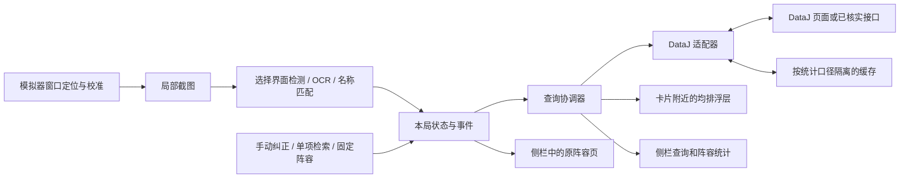

# 金铲铲 DataJ Companion：MVP 技术设计

更新：2026-09-26。状态：方案已获用户认可；P0 已做有限取数验证，并安装隔离依赖、运行 MuMu 全屏截图/浮层工具。已完成公开图片的离线 OCR 与历史 DataJ 快照查询原型；正式产品和实战 OCR 验收尚未完成。本文中的性能、准确率和工期数字均为拟议验收目标或估算，实际试验结果单列在 [MuMu 全屏实测](MuMu全屏实测.md) 和 [公开截图 OCR 验证](公开截图OCR验证.md)。

## 1. 决策摘要

推荐新建轻量 Windows 桌面项目，复用通用开源组件，不整仓 fork 自动对战助手。主线采用 **Python 3.12 x64＋PySide6 Widgets/WebEngine＋RapidOCR/ONNX Runtime CPU＋mss＋少量 Win32 适配**。P0 实测环境已锁定于工具目录的 environment-lock.txt；产品打包依赖仍需验证。

第一版完成三个连贯场景：自动识别强化选择画面并就地显示均排；侧栏便于单条件检索；用户明确固定阵容后，显示原阵容页及对应的强化、出装统计。装备和转职的全面自动识别不作为第一版发布前提。

最先验证 DataJ 取数、目标模拟器截图、窗口穿透三项。它们未通过前，不投入完整 UI 和全装备识别开发。DataJ 结构化取数是完整 MVP 的必要条件；只能打开原站的降级版本不能声称完成了自动均排悬浮功能。

用户已确认：**MuMu，通常全屏**。本机查询为 **Windows 10 专业版 build 19045、64 位**，替换最初 Windows 11 假设。第一版以 MuMu 全屏为目标，只先支持一套已验证的横屏布局；已实测客户区 3840×2160、系统缩放 200%；MuMu 版本、内部渲染分辨率及具体全屏实现待记录。依赖需在该 Windows 版本上验证后锁定。发布范围及项目许可证尚未决定，用户的“可以”表示认可方案。

## 2. 已确定的用户体验

| 场景 | 第一版行为 | 不确定时怎么办 |
|---|---|---|
| 海克斯选择 | 自动检测选择界面、读取回合和三个名称；每张卡附近显示“全局均排”；定阵后增加“该阵容均排” | 未识别就显示“未识别”，允许快捷键重试和手动纠正；不猜 ID |
| 刷新候选 | 任一卡变化即撤下该次旧结果，确认新候选后重新查询 | 不让旧请求的迟到响应覆盖新卡片 |
| 检索器 | 搜索框＋最近查询＋可删除资源标签；点击一个资源切换为单条件检索 | 保留原站入口，允许手动操作 |
| 告诉助手已定阵 | 侧栏打开阵容详情，点击应用自己的“本局玩这个阵容”；也允许粘贴 DataJ 阵容 URL | 浏览别的阵容不自动修改目标 |
| 阵容跟随 | 固定阵容名称、来源页、版本；保留攻略阅读位置；强化/装备查询带上目标阵容 | 原站未提供的细分口径明确显示不支持 |
| 阵容码 | 在原页面复制；应用标明复制对应的阵容/变体，仅在已验证映射时提供独立快捷复制 | 不自行编造阵容码，不模拟游戏内粘贴 |

浮层应在选择期间持续可见，选择页消失、游戏失焦、最小化或用户隐藏时撤下。前文的“3 秒自动消失”不是用户要求，不采用。浮层与侧栏是两个独立窗口：前者不抢焦点、鼠标穿透，后者可正常点击与搜索。

MuMu 全屏时，“侧栏”实现为快捷键展开/收起的浮动面板，不要求桌面预留空间或缩小游戏。默认关闭；展开时接收搜索和点击，收起后把焦点恢复到仍有效的原 MuMu 窗口。打开面板会导致游戏失焦，因此面板与卡片浮层分别管理：面板按用户意图保持，卡片统计撤下或暂停；返回游戏后重新确认画面再显示。热键可配置并检查冲突。P0 已实测热键面板展开/收起和焦点恢复；最终查询面板尚未实现。

第一版不加入复盘系统、自动买牌、自动刷新、棋盘阵容推断、对手侦察、LLM 策略推荐或云端截图分析。

## 3. DataJ 的事实边界

本轮实际浏览了 [强化统计](https://www.dataj.cc/hex)、[检索器](https://www.dataj.cc/explorer)、[阵容排行](https://www.dataj.cc/comp) 和 [地狱火95详情](https://www.dataj.cc/comp/112)。阵容详情的强化标签页存在“区分阶段”、品质、最小样本等控件；勾选后同名强化分成阶段行。英雄标签页内装备表有对局数、平均排名等列。这证明页面支持所需查询形态，不证明存在稳定公开 API。

P0 补充：已从当前页面脚本定位实际入口，对全局海克斯、阵容海克斯、阵容英雄装备、实体目录各做一次 GET，对地狱火纹章单条件做一次 Explorer POST，均返回成功；典型统计行与网页一致。阶段数值在响应的 `roundStats` 中，不能用合并均排替代。详见 [P0 验证记录](P0验证记录.md) 和 [接口源码核查](P0接口源码核查.md)。

仍未完成：每类至少 5 组查询的完整对照、全部筛选语义、Qt 内嵌兼容、阵容码变体对应、数据自动获取/缓存/再展示使用条件确认。这些是网站当前内部接口，不等同于稳定公开 API。具体早期页面观察和组件来源见 [组件与数据研究](组件与数据研究.md)。

推荐的数据路线：

1. 以原站嵌入和页面行为为基准，验证公开页面的结构化字段及筛选结果。先建立少量人工核对样本。
2. 本轮审计未找到可直接复用的 DataJ 适配实现；JinChanChanTool 的统计来源实际是 MetaTFT 代理。DataJ 当前入口已定位并完成有限验证；补齐字段合同及使用条件后，以 HTTPX 实现适配器，保留版本检测与失效降级。
3. 若只能通过页面取得数据，采用隔离的浏览器适配器；Playwright 用于取数验证及页面契约测试。是否随应用分发该运行时，取决于延迟、资源开销和站方使用条件。不要同时无条件携带两个浏览器内核。
4. 页面或接口发生变更即停用受影响能力，并保留原站操作；不绕过登录、验证码或访问限制。

这里冻结的是 DataJAdapter 的输入输出，不是假定某个 `/api/...` 地址已可用。源码里的站点调用也不构成 DataJ 授权或长期接口承诺。

## 4. 架构



采用桌面单应用，不先搭建服务端。UI 留在主线程；截图/OCR 使用有界任务队列与独立 worker，网络请求异步执行。CPU OCR 若阻塞界面则使用独立进程，进程通信只传所需区域和结构化结果。状态由主协调器单点更新，截图 worker 不能直接修改 UI。

Qt WebEngine 自带的页面进程由框架管理。远程 DataJ 页面不暴露文件系统、截图、任意命令或本地密钥接口；只接受经过域名、格式和长度校验的页面信息。弹出的非 DataJ 导航交给系统浏览器；无需为了兼容而关闭浏览器安全机制。

### 模块边界

| 模块 | 输入 → 输出 | 职责与隔离要求 |
|---|---|---|
| platform/windows | 用户选窗口 → WindowBinding | 窗口句柄、PID、客户区、显示器、DPI、可见/前台状态；不操作游戏 |
| capture | WindowBinding＋校准 → Frame | 截图裁剪、帧时间、尺寸版本；不识别、不查询 |
| vision | Frame＋赛季词典 → Observation | 回合、选择页状态、卡位、候选 ID、置信信息；允许 unknown |
| session | Observation＋用户事件 → SessionState | 当前候选、目标阵容、资源标签、会话/候选版本；处理失效 |
| catalog | 来源资料 → 标准实体 | 名称别名、海克斯等级、赛季 ID、装备类型；不存均排作为属性 |
| query | State＋用户查询 → 带口径的结果 | 合并重复查询、取消旧请求、缓存、失败重试 |
| dataj | QuerySpec → StatResult 或明确错误 | 仅此模块知道页面结构/接口字段；返回来源与实际筛选范围 |
| ui/overlay | 已验证候选＋结果 → 卡位标签 | 穿透、不抢焦点、跟随窗口；不直接读 DataJ |
| ui/sidebar | 资源、目标、结果 → 可交互面板 | 原站页面、搜索、固定/取消阵容、手动纠错 |
| storage/diagnostics | 配置/结果/事件 → 本地存储 | SQLite 缓存；日志脱敏；不默认保存连续截图 |

建议未来目录为 `src/companion/{platform,capture,vision,session,catalog,query,dataj,ui,storage}`，另设 `tests/fixtures`、`docs/research`、`licenses`。这是规划目录，本轮未搭建产品代码。

## 5. 识别与窗口策略

**先确认窗口，再确认游戏画布。** EnumWindows 只能定位顶层窗口，模拟器工具栏和黑边仍需排除；通过客户区及一次手动框选建立归一化区域，必要时枚举子窗口。窗口移动、尺寸或 DPI 变化时重新计算映射，不能用固定桌面像素坐标。依据：[Win32 EnumWindows](https://learn.microsoft.com/en-us/windows/win32/api/winuser/nf-winuser-enumwindows)、[GetClientRect](https://learn.microsoft.com/en-us/windows/win32/api/winuser/nf-winuser-getclientrect)、[微软高 DPI 指南](https://learn.microsoft.com/en-us/windows/win32/hidpi/high-dpi-desktop-application-development-on-windows)。

初始截图后端候选为 mss，必须验证用户实际的 MuMu 全屏模式。它是桌面区域截图，不能假定窗口被遮挡或最小化后仍能取得纯游戏画面。全屏黑屏、遮挡、切屏时停止更新并撤下浮层；若目标环境不可靠，再比较 DXcam/WGC。浮层位置避开 OCR 区域，防止把自身文字识别进去。[mss 项目说明](https://github.com/BoboTiG/python-mss#readme)、[DXcam 后端说明](https://github.com/ra1nty/DXcam#capture-backend)。

全屏专项验证覆盖：进入/退出全屏、Alt+Tab 后恢复、卡片点击穿透、浮层是否盖得住游戏、面板打开/关闭的焦点恢复、截图中浮层自污染以及 DPI/多屏映射。须记录 MuMu 版本、渲染设置、显示器尺寸和实际窗口状态；不能从“全屏”一词推定独占或无边框。若窗口模式通过但全屏失败，T03 仍未通过；不得默默缩小首版范围。

拟定识别流水线：选择页布局检测 → 裁剪回合及三个名称 ROI → RapidOCR → 当前赛季名称规范化 → 精确匹配 → 有歧义则拒绝或人工选择。数字/罗马数字、`+`、`++`、同名不同品质必须保留区别；不单靠编辑距离强行归一。图标模板用于布局锚点或难例补充，待实际错例证明收益后加入。

回合位置从样本校准，不采用前文未经核验的“左上角”假设。回合未知时不从时间推断；实际回合与强化选择阶段分字段保存。标准模式之外的强化时机必须有明确映射，不能把任意回合强行归入 2-1/3-2/4-2。

初始调度建议：闲置时低频检测，选择页出现后提高局部识别频率；相同候选保持稳定后才发起查询。拟从闲置 1 Hz、选择页 3–5 Hz 做测试，按真实机器负载调整，网络查询不随每帧重复发起。

### 装备、转职和已选海克斯

| 对象 | 可行性判断（非实测） | MVP 处理 |
|---|---|---|
| 当前三张海克斯及回合 | 文字区域少、候选词典有限，最适合先验证 | 自动识别主线 |
| 已选海克斯 | “看到过候选”不等于“选了它” | 独立确认或用户添加，不根据候选消失猜选择 |
| 装备/转职的文字提示框 | 用户悬停后有名称，可能比小图标更易识别 | 后续快捷键识别试点 |
| 备战席/棋盘装备图标 | 位置多、尺寸小、遮挡和类型差异需实测 | 第一版手动搜索标签；暂不全图自动盘点 |

资源拥有状态与检索条件分开；点击一枚标签替换当前单条件，组合查询作为可选高级操作，不自动把全部资源 AND 在一起。散件、成装、英雄所带装备和“可合成”关系不可混用。

## 6. 状态、数据合同与失效规则

以下为拟定内部模型，不是 DataJ 已公开的接口。

| 数据对象 | 必需字段 |
|---|---|
| WindowBinding | hwnd、pid、client_rect、canvas_rect、dpi_scale、geometry_revision |
| Observation | frame_id、captured_at、geometry_revision、round、choice_stage、scene、每卡位名称/候选/置信信息 |
| SessionState | session_id、state_revision、choice_revision、候选卡位、target_comp、资源标签、当前查询 |
| TargetComp | game、set_id、patch、source_comp_id、name、source_url、guide_variant（可空） |
| QuerySpec | game、mode、set_id、patch、population、time_window、scope、comp_id、stage、entity_id、unit_id、item_type、filters、min_sample |
| StatResult | 原 QuerySpec、actual_scope、avg_placement、sample_count（可空）、source_url、source_updated_at（可空）、fetched_at、status、adapter_version |

`scope` 至少区分 global / comp / comp_unit。装备在“阵容内整体”与“阵容内某英雄”不是同一指标。攻略变体与统计阵容也分别保存；若原站只支持阵容大类统计，就显示大类名，不冒称变体专属统计。

缓存键包含全部影响统计的字段，尤其是游戏、模式、赛季、补丁、阶段、阵容、英雄、装备类型和最小样本。来源没提供的范围标 unknown；不使用网站总局数代替当前行样本。来源更新时间与本地取数时间不能混写。

本次发现实体目录 `season/version` 与页面赛季标签/统计版本不一致，含义尚未澄清。单独保留目录元数据，禁止直接覆盖 QuerySpec 的统计上下文。目标阵容、Explorer 条件和攻略变体分别保存；从条件检索打开阵容页后，不假定详情继续带着原条件。阶段样本门槛按实际 `roundStats.sampleCount` 判断，并与来源自身的过滤规则分别标明。

候选任一卡变化、选择页离开、手动纠错、目标阵容切换、几何变更都会增加相关 revision。请求携带 session/revision/query fingerprint；响应仅在仍匹配时显示。状态不可用时先清理旧显示，再等待新结果。

错误至少包括：unrecognized、unsupported_scope、no_data、below_min_sample、source_unavailable、schema_changed、version_mismatch。缺失值显示“—＋原因”，不填 0，也不拿全局均排填阵容均排。

缓存刷新策略在 DataJ 条款和数据更新频率核实后设定。建议候选稳定时按版本读取/预取有限统计表、请求去重、退避处理 429/5xx；不每帧访问网站、不提前扫全站。跨补丁不复用；过期缓存明确标旧，默认不作为当前均排浮层显示。

## 7. 交互草图（示意值，不是真实统计）

```text
                模拟器内三张强化卡
     [海克斯 A]         [海克斯 B]         [海克斯 C]
     全局 4.xx          全局 4.xx          全局 —
     阵容 3.xx          阵容 4.xx          阵容 —
                                          未识别

侧栏
  本局阵容：已固定的阵容        [更换] [取消]
  [检索] [阵容攻略] [出装] [强化]
  搜索：英雄 / 装备 / 转职 / 海克斯
  最近与资源：[标签 A] [标签 B] [手动添加]
  本次条件：[标签 A ×]        （默认单项）
  原 DataJ 页面 / 查询结果
  版本、范围、样本与来源入口
```

浮层默认紧凑显示平均排名。数据详情放在侧栏，避免信息堆到卡面；鼠标穿透的浮层不依赖鼠标 hover 才能解释错误。全局与阵容两行有明确标签，并展示当前阶段；不加“提升多少名次”这类因果结论。

## 8. 技术路线取舍

Python 路线让识别、词典和查询共享语言，Qt 同时承载浮层和原站视图，适合当前小范围桌面工具。PySide6 的许可路径优于直接继承 PyQt5 原型，但仍需履行所选 Qt 模块的 LGPL/其他第三方义务。[Qt 许可](https://doc.qt.io/qt-6/licensing.html)、[PyQt 许可](https://www.riverbankcomputing.com/software/pyqt/intro)。

C#/.NET＋WebView2 是 Windows 产品化备选：窗口管理自然，但会增加 Python 识别进程桥接或迁移识别实现的工作。若首轮证明 Qt WebEngine 无法兼容关键页面，或项目确定以 C# 维护，再重新评估；当前不并行维护两套 UI。

Electron 支持相关窗口能力且项目采用 MIT，可作为 Web UI 方向备选，但此 MVP 仍需要识别 worker 和桌面适配，因此不因网页较多就增加一套 JS/Python 双栈。[BrowserWindow 文档](https://www.electronjs.org/docs/latest/api/browser-window)、[Electron LICENSE](https://github.com/electron/electron/blob/main/LICENSE)。这是基于本项目范围的工程判断，并非性能实测排名。

技术栈、组件许可和来源完整矩阵见 [组件与数据研究](组件与数据研究.md)；实施阶段和验收见 [开发阶段与任务](开发阶段与任务.md)。

## S18 样本约束（2026-09-26 补充）

当前目标为 S18 自然之力；词典和统计按赛季/版本隔离。历史及赛季不明图片仅验证布局，不计入当前赛季 OCR 指标。已重新核对目录 263 条、18.2a 统计 229 条，详情见 [S18 赛季核对](S18赛季核对.md)。
