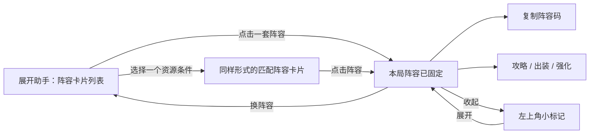

# 主流 TFT 助手交互复查与 DataJ Companion 改版方案

日期：2026-09-27。状态：调研与改版建议，尚未修改正式 UI。

## 结论

首页改为可直接选择的阵容卡片列表。点击卡片即选择本局目标，不再要求粘贴 URL、打开攻略、再点一次固定。选定后进入围绕该阵容的攻略页，复制主阵容码、出装和强化查询都从这里进入。海克斯卡片均排仍独立显示在游戏里。

这覆盖旧设计中“先浏览，再显式点本局玩这个阵容”的主要入口；网页内浏览其他链接仍不应悄悄换阵。

## 一、证据与限制

本轮核对官方网页与操作说明，没有安装四款客户端逐一实测。旧文章可证明交互设计思路，不能保证最新版本按钮与布局完全相同。以下选择是典型产品对照，不是经过装机量验证的市场排名。

| 产品 | 官方证据确认的交互 | 对我们的启发 | 时效与限制 |
|---|---|---|---|
| MetaTFT | 阵容页作为主要参考；可置顶阵容；可固定游戏内阵容；详情分层查看人口阵容、过渡、快速攻略及装备信息 | 阵容优先的首页、固定目标、在局内快速展开所需资料 | [官方操作说明](https://ghost.metatft.com/how-to-use-the-metatft-app/) 发布于 2023-08-11；本轮读取当前页面，但不把旧截图当作最新版客户端实测 |
| Mobalytics | 点击阵容后相关组件跟随目标；可切换阵容；攻略包含站位和过渡；说明中有组件显隐、缩放设置 | 点选即联动；固定阵容下聚合攻略；浮窗尺寸可调 | [官方操作说明](https://mobalytics.gg/blog/tft/how-to-use-the-mobalytics-tft-overlay/) 发布于 2020-05-21；[当前下载页](https://mobalytics.gg/tft/glp/app-download) 仍展示阵容与攻略能力，但不能用来核实旧按钮位置 |
| TFTactics | 提供推荐阵容或自行规划；Board Tracker 可固定最终阵容；另有英雄信息与装备合成查询 | 同一个固定目标贯穿局内查询，不重复选择阵容 | [官网](https://tftactics.gg/) 为功能概述，无具体按钮流程与发布日期；不声称核实了缩放/折叠细节 |
| Blitz | 官方历史文章介绍阵容建议及替代、强化、经济相关内容 | 阵容详情可以组织多个相关决策入口 | [The Blitz App 官方文章](https://medium.com/blitz-press/how-blitz-gg-uses-machine-learning-to-analyze-tft-compositions-eefc8527ba6d)，2023-05-19；主站访问受限，当前固定/折叠/缩放交互未核实，不作为具体按钮设计依据 |
| DataJ | 阵容排行和阵容详情是现有数据与攻略入口 | 保留 DataJ 数据口径、均排颜色和原攻略，不用 TFT 产品的数据代替金铲铲数据 | [阵容排行](https://www.dataj.cc/comp)、[阵容详情示例](https://www.dataj.cc/comp/112)；页面能力不等于已有稳定列表 API |

MetaTFT 和 Mobalytics 的游戏客户端集成不能直接迁移为 MuMu 识别能力；本轮只借鉴交互组织。

## 二、现有 UI 为什么绕

当前源码见 [app.py](companion/app.py)：`make_choices`、`make_explorer`、`make_guide`、`pin_comp`、`copy_code`。

- 默认首页强调识别模式、截图按钮和三张海克斯结果卡；用户需要的“先看几套阵容”不在首页。
- 阵容攻略入口以 URL 输入框开始，选阵需要跨页面操作。
- 单条件检索结果是表格，双击只打开网页，之后还需额外固定。
- 阵容内出装独立成导航，使用时需要重新理解目标阵容和英雄上下文。
- 设置和状态提示占据主要空间，和用户每局需要看的内容争抢位置。

之前的 [MVP 技术设计](MVP技术设计.md) 冻结了单条件检索、DataJ 来源、局内浮层与面板分离；这些保留。[旧 UI 方案](UI设计与验证.md) 主要解决样式一致性，这次解决操作顺序。

## 三、建议的操作流程

### 未定阵：首屏就是候选阵容

采用纵向排列的紧凑横卡，而不是每套占半屏的大封面。常规尺寸争取一屏容纳 4–6 套，实际数量由字体和用户缩放决定。

每张卡显示阵容名、核心英雄头像与名字、主要羁绊、均排和样本数。来源确实提供阵容评级时才显示评级；不自行把均排转换成 S/A 标签。缺失字段用缺失状态，不能伪造推荐标签或英雄组合。

顶部放“搜索阵容/英雄”、排序、收藏。单条件查询入口位于搜索附近：选择一个海克斯、转职或装备，立即替换列表；已选条件做成一个可清除标签。默认继续维持单条件，避免组合筛选结果过少。

卡片的主操作统一为“选这套”；点击卡片主体也执行同一动作。收藏星号只收藏，不切换当前目标。若以后需要预览，再加次级入口，第一版不要重新制造两次确认。

### 已定阵：围绕这一套组织内容

固定标题条：`本局：阵容名  ·  变体名`，旁边直接放“复制阵容码”“换阵容”“收起”。

下面只保留“攻略 / 出装 / 强化”三个内容标签：

- 攻略：先用 DataJ 当前阵容页，保留阅读位置。能可靠映射的小节再做“站位 / 前期 / 中期 / 成型”直达；不根据猜测锚点承诺一步跳转。
- 出装：默认显示本阵容英雄行，点击英雄直接查装备。保留普通、奥恩、光明装备筛选；全局与本阵容均排分开标记。
- 强化：默认使用本局已识别阶段；允许切换 2-1、3-2、4-2，始终显示阶段标签。浮层仍直接显示当前候选，不要求打开这个页。

复制按钮必须说明复制对象，例如“复制主阵容码”或“复制 8 人口变体码”。现有代码仅核实主阵容码；未核实变体映射前，不把网页变体选择伪装成已联动的复制功能。

选完后给出明确“已固定”状态，不弹额外确认框。没有阵容码时禁用复制并说明原因，不静默无响应。

### 换阵容、回到列表与新的一局

- 点“换阵容”只回到列表，当前目标仍保留；点另一张卡片才发起切换。
- 切换时先清除旧阵容统计，显示新目标正在读取；所有旧请求都带目标版本，迟到结果不能覆盖新选择。
- 若详情失败，显示新目标加载失败和重试入口；不能在新名字下面保留旧阵容码或旧攻略。备选实现是事务式切换，成功后再替换旧目标，但界面必须明确仍在使用旧目标。
- 攻略网页中点到别的阵容，不自动改变固定目标；本局标题始终可见。
- 收起/展开保留当前标签、阅读位置、窗口尺寸。
- 新的一局清空固定目标、阶段和本局统计；收藏可保留，不自动把上局阵容当成这局已经选定。

## 四、局内窗口与可调整项

保留两个分离的区域：

1. 三个海克斯均排小框：停在卡片底部 T 标签区域，保持点击穿透，不进入文字说明区；已修复的防闪烁机制保留。
2. 左上角助手面板：未定阵展示候选，定阵后展示本局攻略，收起后只留小标记。

建议允许拖动面板、小标记和调整面板大小；常用宽度先做“紧凑 / 宽屏”两档，字体缩放独立于窗口大小。窗口位置与尺寸保存，屏幕变化后夹回可见区域。面板外的区域继续接收游戏操作，不能用透明全屏窗口吞鼠标。

“手动/阶段触发、鼠标侧键、字体大小、窗口恢复位置”集中进齿轮设置。首页仅保留一句小状态，例如“侧键可查均排”，不占据大块主区域。

这些是本项目建议，不能表述成四款竞品全部都支持的现成行为。

## 五、实现顺序及依赖

| 阶段 | 可验收结果 | 关键依赖 |
|---|---|---|
| 1：可点击布局样机 | 一屏多阵容、点选即固定、固定后标题和按钮、换阵与收起能走通 | 明确标注示例内容，不连真实游戏，不修改稳定识别链 |
| 2：真实阵容卡片 | DataJ 列表、搜索、单条件结果采用同一组件；来源版本可见 | 新增并验证阵容列表取数合同；现有 DataJAdapter 只有详情和检索，不能假设已有列表接口 |
| 3：固定与详情 | 一次选择联动攻略/主阵容码/英雄出装/强化；失败与快速换阵正确 | 复用 session.target、comp_generation、copy_code，消除旧响应串阵 |
| 4：紧凑局内使用 | 尺寸/位置持久化、展开恢复阅读位置、局外不抢焦点 | Qt 多屏/DPI、点击穿透和现有截图浮层回归 |

英雄图标只按当前可见卡片加载并缓存；列表展开不触发截图，不为每张卡预开 WebEngine，不因切换 UI 提高后台 OCR 频率。没有真实数据时显示加载/失败状态，不以静态热门阵容冒充当前排行。

## 六、验收清单

- 从展开到固定阵容只需点一张卡；之后复制主阵容码只需再点一次。
- 同屏至少能比较多套阵容，长阵容名、英雄名和缩放不横向截断。
- 普通列表与单条件结果里的相同阵容可以走同一固定流程；条件内均排不能被标成全局均排。
- 连续快速点 A、B 后，A 的晚返回不能改掉 B 的攻略、码或统计。
- 收起再展开仍停在上次阅读位置；换阵必须有清晰标题变化。
- 未取得详情、无码、来源失败时按钮和提示都有明确状态。
- 2-1/3-2/4-2 海克斯浮层位置、稳定显示和鼠标穿透回归通过。
- 启动 OCR 初始化修复保留；新增 UI 不恢复后台初始化崩溃。

## 本轮产物边界

本轮完成官方交互证据复查和改版方案。没有修改正式 UI，也没有声称安装实测了四款竞品的当前版本。
